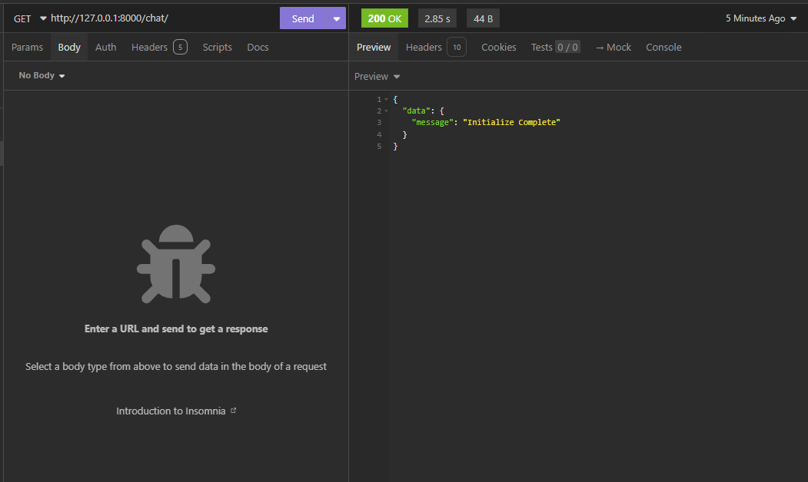
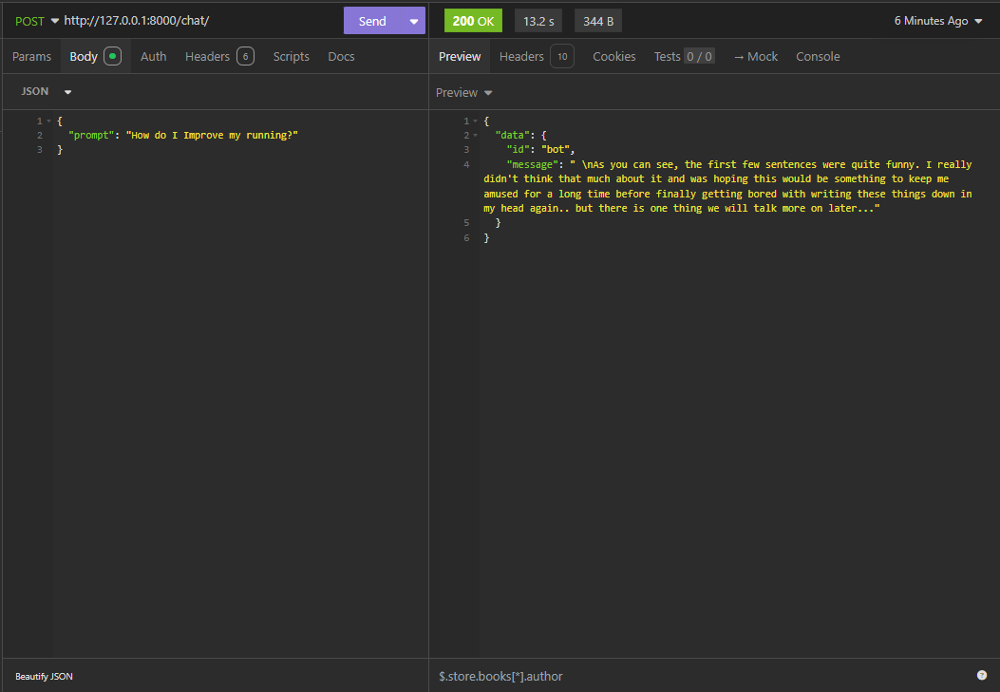

# conexsus-langchain-be

## Getting started

### Install Python Package
```
pipenv install
```

### Run the Backend
```
cd llm_chat_project
pipenv run python manage.py runserver
```

## API Information

```
GET /chat/

Response: <200 Status>
{
	"message": "Initialize Complete"
}

```
Initialize the LangChain Hugginface Pipeline
using GPT2 opensource model

Insomnia Screenshot


```
Post /chat/

Request:
{
	"prompt": "What is Mathematics?"
}

Response: <200 Status>
{
	"data": {
		"id": "bot",
		"message": " \"We're not going to get into the details of what that means,\" he said. \"The reason for it is because our mission at this point has been, 'How do you go about doing a project like these? Why are we so focused on making sure everyone gets their own copy?' And then they ask questions and come back with suggestions or things.\"\n- Michael Strain"
	}
}

```
This API ask a prompt for the user then output the response from the model


